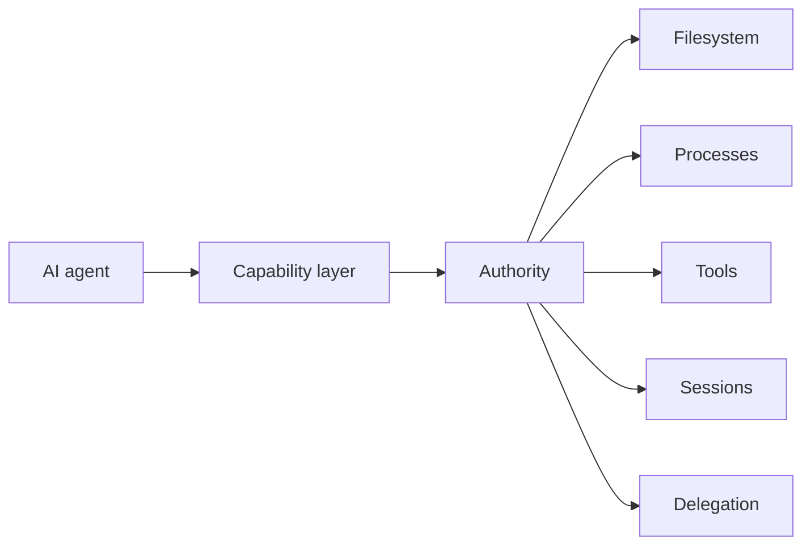
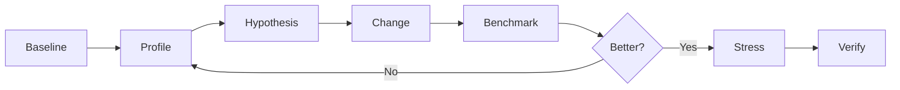

# Jackson Cummings

### Autodidactic Engineer · Systems Builder · Applied Researcher

I build systems across **software, AI infrastructure, graphics, scientific computing, process engineering, and design**.

My work tends to begin the same way: understand the mechanism, instrument it, build a model, measure what matters, then iterate until the system is meaningfully better.

 

---

## I engineer across boundaries

I am an independent, self-taught engineer based in St. Louis.

I did not arrive here through one discipline. I learned by solving problems that forced me underneath the abstraction.

A presentation editor became browser rendering and computational geometry.  
AI tooling became concurrency, authority, persistence, IPC, and distributed state.  
Packaging became deterministic vector geometry.  
A freeze dryer became thermodynamics, vacuum physics, firmware, and control theory.  
Crystallization became instrumentation, transport phenomena, and process optimization.

That is the common thread in my work.

> **Build from first principles. Measure the real system. Keep the evidence.**

---

## Core work

| Field | Focus |
| --- | --- |
| **Software & systems** | Desktop applications, runtimes, IPC, persistence, concurrency, protocols, developer tooling |
| **AI infrastructure** | Agent systems, MCP, OXP, tool design, orchestration, permissions, context, multi-agent workflows |
| **Performance** | Profiling, benchmarking, hot-path redesign, bounded concurrency, caching, data structures |
| **Graphics & documents** | Vector geometry, SVG, PDF, PPTX, browser rendering, semantic document generation |
| **Scientific engineering** | Crystallization, lyophilization, vacuum systems, heat transfer, instrumentation, process control |
| **Design & manufacturing** | Packaging, dielines, production artwork, visual systems, technical communication |

---

# Selected work

### OpenFork
**A desktop-first AI development environment built from OpenCode.**

[github.com/thelabcorner/openfork](https://github.com/thelabcorner/openfork)

One of my largest systems projects. I work across the application stack, including:

`agent tooling` · `concurrent sessions` · `server projections` · `SQLite` · `Electron` · `browser automation` · `usage accounting` · `model routing` · `mobile/PWA` · `performance`

I have also developed a substantial first-party agent tool surface:

`project` · `symbols` · `test` · `typecheck` · `refactor` · `patch` · `background` · `swarm` · `browser` · `checkpoint` · `Git` · `SQLite` · `SymPy`

Performance work is benchmarked against real workloads, including large histories, 50,000-node project trees, hundreds of models, throttled Chromium, concurrent sessions, and high-contention workloads.

---

### AI capability infrastructure
**OXP · getMCP · localMCP-chat · openswarm**

A continuing body of work around giving AI systems powerful local capabilities without giving them uncontrolled authority.

This includes:

- scoped filesystem authority
- replay-safe mutations
- execution and cancellation
- process-tree lifecycle control
- capability revocation
- provenance
- durable background work
- multi-agent coordination
- permission propagation
- external tool aggregation

**getMCP** even explores a transport where an agent capable only of reading URLs can still operate a controlled coding environment, with the URL itself acting as the RPC surface.

---

### PresGen
**Creative software for technical communication.**

[presgen.io](https://presgen.io)

I founded PresGen to explore what presentation software looks like when treated as a serious creative engineering environment.

It combines ideas from Illustrator, motion software, scientific visualization, and traditional presentation tools.

Work includes:

`vector editing` · `animation` · `rich text` · `LaTeX` · `graphing` · `chemistry` · `SVG` · `PDF` · `PPTX` · `Electron`

PresGen has also produced several deeper engineering projects, including **ForgePrint**, a browser-native engine that converts the live DOM and CSSOM into semantic PDF primitives instead of rasterizing the page.

---

### Adobe Illustrator engineering
**ArcFit · ESPACK · ESON · ESB64 · ESHTTP · ESARR · ESSTR · ESTIMER**

[arcfit.dev](https://arcfit.dev)

Working deeply with Illustrator exposed two classes of problems.

First, packaging geometry. **ArcFit** provides deterministic artwork warping based on the physical dieline instead of unreliable hidden or clipped Illustrator geometry.

Second, the ExtendScript runtime itself. Adobe's ES3 environment lacks much of the modern JavaScript platform, so I built the infrastructure I wanted to have:

| Project | Purpose |
| --- | --- |
| **ESON** | Strict JSON |
| **ESB64** | Base64 and UTF-8 |
| **ESHTTP** | HTTP transport |
| **ESTIMER** | High-resolution timing |
| **ESPACK** | Self-extracting native `ExternalObject` bundles |
| **ESARR / ESSTR** | Runtime compatibility primitives |

The work includes native acceleration, differential fuzzing, browser conformance tests, binary packaging, and live-engine benchmarking.

---

### Scientific & process engineering

Before software became my dominant engineering medium, much of my work centered on physical systems.

#### Crystallization

At Carboxyl Manufacturing I worked on phytocannabinoid crystallization, manufacturing R&D, instrumentation, and process optimization.

I developed a **Python and Raspberry Pi crystallization incubator** with closed-loop thermal control, environmental sensing, and process telemetry.

That work contributed to a reported **44% improvement in process efficiency** across the broader engineering program.

#### Freeze-dryer reverse engineering

I also spent years investigating freeze drying from first principles.

What started as understanding a machine expanded into:

`thermodynamics` · `vacuum physics` · `gas conduction` · `heat transfer` · `Pirani sensing` · `firmware` · `refrigeration` · `control systems`

I reverse-engineered commercial firmware and developed models around pressure-dependent thermal transport inside the vacuum chamber.

The most important insight was simple: **residual chamber gas is not merely something to remove. In the relevant pressure regime, it is part of the heat-transfer system.**

---

### Research projects

**CIDARTHA**  
High-performance CIDR membership infrastructure using native C, compiled data planes, adaptive representations, packed operations, and SIMD-assisted search.

[github.com/thelabcorner/CIDARTHA](https://github.com/thelabcorner/CIDARTHA)

**Project ANVIL**  
Experimental lossless compression research focused on the compression, encode, decode, and memory Pareto frontier.

[github.com/thelabcorner/anvil](https://github.com/thelabcorner/anvil)

One rule drives ANVIL:

> **A ratio win is not a codec win.**

Failed mechanisms stay in the research record instead of being rewritten as successes.

---

## Engineering methodology

I care about performance, but not optimization theater.

I usually look for architectural wins before micro-optimizations:

- remove work instead of making unnecessary work faster
- make recomputation incremental
- encode invariants directly in the data structure
- bound concurrency and fanout
- defer work until it is actually needed
- benchmark the real bottleneck
- test under contention
- measure secondary costs
- preserve failed experiments so they are not rediscovered

---

## Experience

| | |
| --- | --- |
| **Founder & Full-Stack Engineer** | **PresGen** · creative software, rendering, document engineering |
| **Full-Stack Developer & Administrator** | **Engineering Minds** · STEM infrastructure, automation, community systems |
| **Founder** | **TheDabCorner™ LLC** · engineering, packaging, software, design |
| **Process Engineering Lead** | **Carboxyl Manufacturing** · crystallization, R&D, instrumentation, process optimization |

---

## Technical surface

**Languages**  
`TypeScript` `JavaScript` `Python` `C` `C++` `Java` `SQL` `ExtendScript`

**Systems**  
`Electron` `Node.js` `Bun` `SQLite` `IPC` `HTTP` `SSE` `MCP` `CDP` `GitHub Actions`

**Graphics & documents**  
`SVG` `Canvas` `PDF` `PPTX` `DOM/CSSOM` `Adobe Illustrator` `vector geometry`

**Scientific**  
`crystallization` `thermodynamics` `vacuum systems` `heat transfer` `process control` `instrumentation`

---

### Understand the mechanism. Build the model. Measure what matters.

[Portfolio](https://thedabcorner.site) · [PresGen](https://presgen.io) · [Engineering Minds](https://engineeringminds.co)

