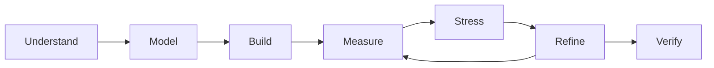
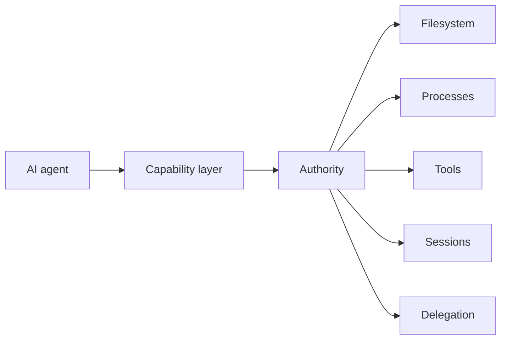
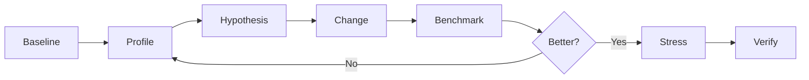

# Jackson Cummings

### Autodidactic Engineer · Systems Builder · Applied Researcher

I build systems across **software, AI infrastructure, graphics, scientific computing, process engineering, and design**.

My work usually starts the same way: understand the mechanism, make the model explicit, instrument the real system, then iterate until the result is measurably better.

 

---

## Background

I started programming around **12 years old**, building Minecraft servers, mods, and Java plugins. Bukkit, Spigot, and Paper were my first real engineering environment: event-driven systems, schedulers, persistence, permissions, APIs, JVM behavior, profiling, and performance under real users.

That work never really stopped. More recent Minecraft projects include [GeyserCommandsYML](https://github.com/thelabcorner/GeyserCommandsYML), while the systems thinking I learned there eventually expanded far beyond game servers.

I did **not attend college and do not have a degree**. My education has been self-directed through source code, documentation, research papers, experiments, reverse engineering, benchmarking, and years of building systems that had to actually work.

I tend to think across abstraction layers. Technical language is not decoration to me. Terms imply mechanisms, contracts, invariants, and failure modes, and I usually keep descending until those are explicit enough to build against.

> **Build from first principles. Measure the real system. Keep the evidence.**

---

## Core work

| Field | Focus |
| --- | --- |
| **Software & systems** | Desktop applications, runtimes, IPC, persistence, concurrency, protocols, developer tooling |
| **AI infrastructure** | Agent systems, MCP, [OXP](https://github.com/thelabcorner/openfork), tool design, orchestration, permissions, context, multi-agent workflows |
| **Performance** | Profiling, benchmarking, hot-path redesign, bounded concurrency, caching, data structures |
| **Graphics & documents** | Vector geometry, SVG, PDF, PPTX, browser rendering, semantic document generation |
| **Scientific engineering** | Crystallization, lyophilization, vacuum systems, heat transfer, instrumentation, process control |
| **Design & manufacturing** | Packaging, dielines, production artwork, visual systems, technical communication |

---

# Selected work

### [OpenFork](https://github.com/thelabcorner/openfork)
**Desktop-first AI development environment built from OpenCode.**

One of my largest systems projects. I work across the application stack:

`agent tooling` · `concurrent sessions` · `server projections` · `SQLite` · `Electron` · `browser automation` · `usage accounting` · `model routing` · `mobile/PWA` · `performance`

I have also developed a substantial first-party tool surface inside [OpenFork](https://github.com/thelabcorner/openfork):

`project` · `symbols` · `test` · `typecheck` · `refactor` · `patch` · `background` · `swarm` · `browser` · `checkpoint` · `Git` · `SQLite` · `SymPy`

Performance work is benchmarked against real workloads, including large histories, 50,000-node project trees, hundreds of models, throttled Chromium, concurrent sessions, and high-contention workloads.

---

### AI capability infrastructure
**[OXP](https://github.com/thelabcorner/openfork) · [getMCP](https://github.com/thelabcorner/getMCP) · [localMCP-chat](https://github.com/thelabcorner/localMCP-chat) · [openswarm](https://github.com/thelabcorner/openswarm)**

A continuing body of work around giving AI systems powerful local capabilities without giving them uncontrolled authority.

Across [OXP](https://github.com/thelabcorner/openfork), [getMCP](https://github.com/thelabcorner/getMCP), [localMCP-chat](https://github.com/thelabcorner/localMCP-chat), and [openswarm](https://github.com/thelabcorner/openswarm), the recurring problems are:

- scoped filesystem authority
- replay-safe mutations
- execution and cancellation
- process-tree lifecycle control
- capability revocation
- provenance
- durable background work
- multi-agent coordination
- permission propagation
- external tool aggregation

[getMCP](https://github.com/thelabcorner/getMCP) even explores a transport where an agent capable only of reading URLs can operate a controlled coding environment, with the URL itself acting as the RPC surface.

---

### [PresGen](https://presgen.io)
**Creative software for technical communication.**

I founded [PresGen](https://presgen.io) to explore what presentation software looks like when treated as a serious creative engineering environment.

It combines ideas from Illustrator, motion software, scientific visualization, and traditional presentation tools:

`vector editing` · `animation` · `rich text` · `LaTeX` · `graphing` · `chemistry` · `SVG` · `PDF` · `PPTX` · `Electron`

That work has also produced deeper systems such as [ForgePrint](https://github.com/thelabcorner/forgeprint), a browser-native engine that converts the live DOM and CSSOM into semantic PDF primitives instead of rasterizing the page.

---

### Adobe Illustrator engineering
**[ArcFit](https://arcfit.dev) · [ESPACK](https://github.com/thelabcorner/espack) · [ESON](https://github.com/thelabcorner/eson) · [ESB64](https://github.com/thelabcorner/es-b64) · [ESHTTP](https://github.com/thelabcorner/es-http) · [ESARR](https://github.com/thelabcorner/es-arr) · [ESSTR](https://github.com/thelabcorner/es-str) · [ESTIMER](https://github.com/thelabcorner/es-timer) · [ESCHARS](https://github.com/thelabcorner/es-chars)**

Working deeply with Illustrator exposed two classes of problems.

First, packaging geometry. [ArcFit](https://arcfit.dev) provides deterministic artwork warping based on the physical dieline instead of unreliable hidden or clipped Illustrator geometry.

Second, the ExtendScript runtime itself. Adobe's ES3 environment lacks much of the modern JavaScript platform, so I built the infrastructure I wanted to have.

| Project | Purpose |
| --- | --- |
| [**ESON**](https://github.com/thelabcorner/eson) | Strict JSON |
| [**ESB64**](https://github.com/thelabcorner/es-b64) | Base64 and UTF-8 |
| [**ESHTTP**](https://github.com/thelabcorner/es-http) | HTTP transport |
| [**ESTIMER**](https://github.com/thelabcorner/es-timer) | High-resolution timing |
| [**ESPACK**](https://github.com/thelabcorner/espack) | Self-extracting native `ExternalObject` bundles |
| [**ESARR**](https://github.com/thelabcorner/es-arr) / [**ESSTR**](https://github.com/thelabcorner/es-str) | Runtime compatibility primitives |
| [**ESCHARS**](https://github.com/thelabcorner/es-chars) | Accelerated bulk character operations |

The work includes native acceleration, differential fuzzing, browser conformance tests, binary packaging, reverse engineering, and live-engine benchmarking.

---

### Scientific & process engineering

Software has been part of my life since childhood. Later, I began applying the same systems mindset to physical processes.

#### Crystallization

At Carboxyl Manufacturing I worked on phytocannabinoid crystallization, manufacturing R&D, instrumentation, and process optimization.

I developed a **Python and Raspberry Pi crystallization incubator** with closed-loop thermal control, environmental sensing, and process telemetry.

That work contributed to a reported **44% improvement in process efficiency** across the broader engineering program.

#### Freeze-dryer reverse engineering

A long-running investigation into freeze drying expanded into:

`thermodynamics` · `vacuum physics` · `gas conduction` · `heat transfer` · `Pirani sensing` · `firmware` · `refrigeration` · `control systems`

I reverse-engineered commercial firmware and developed models around pressure-dependent thermal transport inside the vacuum chamber.

The key insight was simple: **residual chamber gas is not merely something to remove. In the relevant pressure regime, it is part of the heat-transfer system.**

---

### Research projects

[**CIDARTHA**](https://github.com/thelabcorner/CIDARTHA)  
High-performance CIDR membership infrastructure using native C, compiled data planes, adaptive representations, packed operations, and SIMD-assisted search.

[**Project ANVIL**](https://github.com/thelabcorner/anvil)  
Experimental lossless-compression research focused on the compression, encode, decode, and memory Pareto frontier.

One rule drives [Project ANVIL](https://github.com/thelabcorner/anvil):

> **A ratio win is not a codec win.**

Failed mechanisms stay in the research record instead of being rewritten as successes.

---

## How I work

I am deliberate about semantics, architecture, and evidence.

A vague requirement usually becomes a set of explicit invariants before I implement it. A performance claim becomes a benchmark. A surprising behavior becomes an experiment. A failed idea becomes part of the research record.

I usually look for architectural wins before micro-optimizations:

- remove work instead of making unnecessary work faster
- make recomputation incremental
- encode invariants directly in the data structure
- bound concurrency and fanout
- defer work until it is actually needed
- benchmark the real bottleneck
- test under contention
- measure secondary costs
- preserve negative results so they are not rediscovered

---

## Experience

| | |
| --- | --- |
| **Founder & Full-Stack Engineer** | [**PresGen**](https://presgen.io) · creative software, rendering, document engineering |
| **Full-Stack Developer & Administrator** | [**Engineering Minds**](https://engineeringminds.co) · STEM infrastructure, automation, community systems |
| **Founder** | [**TheDabCorner™ LLC**](https://thedabcorner.site) · engineering, packaging, software, design |
| **Process Engineering Lead** | **Carboxyl Manufacturing** · crystallization, R&D, instrumentation, process optimization |

---

## Technical surface

**Languages**  
`TypeScript` `JavaScript` `Python` `C` `C++` `Java` `SQL` `ExtendScript`

**Systems**  
`Electron` `Node.js` `Bun` `SQLite` `IPC` `HTTP` `SSE` `MCP` `CDP` `GitHub Actions`

**Graphics & documents**  
`SVG` `Canvas` `PDF` `PPTX` `DOM/CSSOM` `Adobe Illustrator` `vector geometry`

**Scientific**  
`crystallization` `thermodynamics` `vacuum systems` `heat transfer` `process control` `instrumentation`

---

### Understand the mechanism. Build the model. Measure what matters.

[Portfolio](https://thedabcorner.site) · [PresGen](https://presgen.io) · [Engineering Minds](https://engineeringminds.co) · [Repositories](https://github.com/thelabcorner?tab=repositories)

